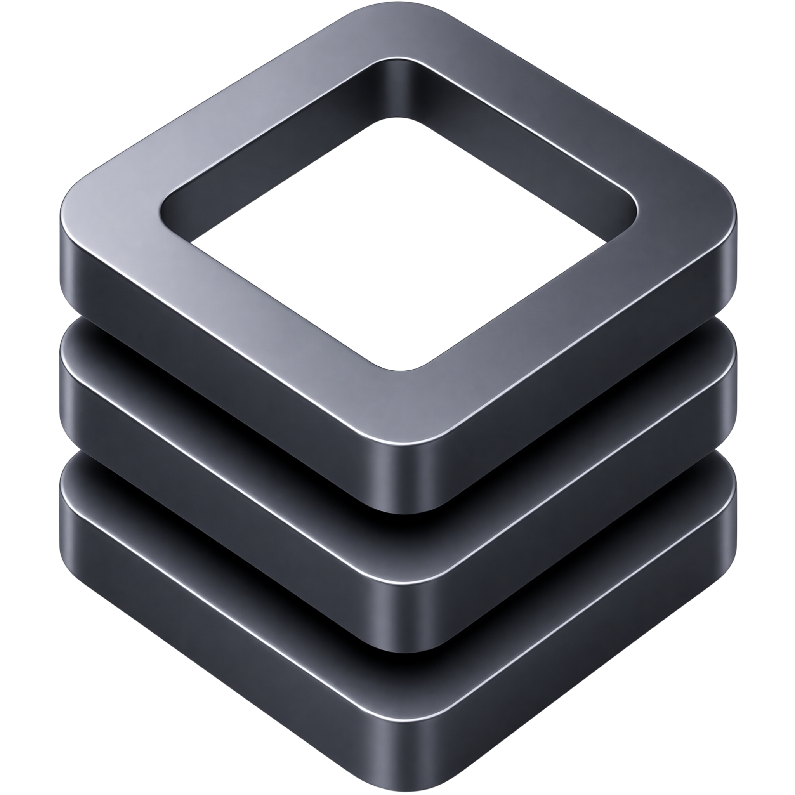

<br />
<div align="center">
    
</div>


<h1 align="center">Strata</h1>

<p align="center">
    A source-first Vue UI kit with reusable primitives for building application interfaces without package registry ceremony.
    <br />
    <br />
    <br />
    <a href="https://vuejs.org/">
        
    </a>
    <a href="https://www.typescriptlang.org/">
        
    </a>
    <a href="https://tailwindcss.com/">
        
    </a>
    <a href="https://bun.sh/">
        
    </a>
</p>

---

## Overview

Strata is a source-first Vue UI kit designed to be copied directly into a project rather than installed from a package registry. The components and shared stylesheet become part of the project and can be used, modified, or extended like any other application code.

It includes foundational interface primitives such as buttons, fields, menus, dialogs, sheets, tabs, tables, calendars, date pickers, dropdowns, popovers, tooltips, sliders, toggles, navigation, upload controls, and more.

---

## Requirements

- Vue 3 (`vue`)
- Tailwind CSS v4 (`tailwindcss`)
- Reka UI (`reka-ui`)
- Lucide Vue (`@lucide/vue`)

The components and shared stylesheet are included with Strata. Bun and the vendored dependencies under `deps/` are only required when developing Strata itself.

---

## Installation

Copy `deps/strata/ui` and `src/app.css` into your Vue project.

Strata's `app.css` contains the default theme, component utilities, and shared styles used by the components. In a new project, use it as your application stylesheet. In an existing project, merge or adapt it to fit your current styles while retaining the tokens, utilities, and component rules that Strata relies on.

Import the stylesheet once from your application entry point:

```ts
import './app.css'
```

The copied source belongs to your project and may be modified as needed.

---

## Updating

Updates are optional. Because Strata is copied into your project as owned source, there is no automatic update process or expectation that projects stay synchronized.

If a newer component or fix is useful, copy that change into your project and merge it with any local modifications.

---

## Customization

The copied components belong to your project. Edit them directly, wrap them, compose them, or remove anything you do not need.

The default colors, typography, spacing, radii, shadows, animations, and shared behavior are defined in `app.css`. Modify those values to adapt Strata to your application.

---

## Developing Strata

Strata includes an offline development and build pipeline under `deps/`. No package installation is required.

Run the development server:

```bash
./deps/build/cli-bun deps/build/runner-dev.ts
```

Open `http://localhost:3000/`.

Build the static output:

```bash
./deps/build/cli-bun deps/build/runner-build.ts
```

The build writes the self-contained output to `docs/`.

---

## Philosophy

Strata is intentionally self-contained. Its development and build dependencies are vendored under `deps/`, allowing the repository to run and build offline without global installations, package registry access, or a separate dependency installation step.

This is primarily a preference for personal projects: I prefer the project to not depend on external package availability simply to remain buildable. Everything needed to work on Strata is kept with the repository.

This approach is not a recommendation for every project. Consuming projects may use their normal package manager and dependency workflow; Strata's components are still ordinary Vue source files.
